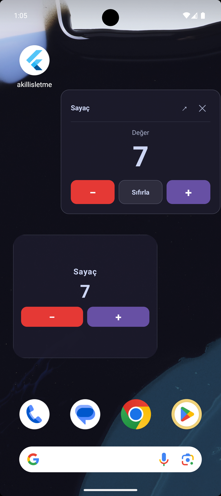

# Flutter Starter Template

A ready-to-use Flutter boilerplate for starting new projects without setting up architecture from scratch. Clone, configure, and start building features immediately.

## Screenshots

  
  
  
  
  
  
  

## Tech Stack

| Category | Package |
|---|---|
| State Management | flutter_bloc, freezed |
| DI | get_it |
| Routing | go_router, go_router_builder |
| Cache | hive_ce, shared_preferences |
| Localization | easy_localization |
| Code Generation | build_runner, flutter_gen_runner, freezed, json_serializable |
| UI | flutter_svg, lottie, shimmer, smooth_page_indicator |

## Getting Started

After cloning, see **[`doc/project.md`](doc/project.md)** — the main project guide. It covers everything you need to get started.

If this is a fresh clone, follow **[`doc/new_feature/setup_after_clone.md`](doc/new_feature/setup_after_clone.md)** first to clean generated files, install dependencies, and run code generation.

## Documentation

The `doc/` directory is the built-in knowledge base for this project. Instead of memorizing conventions, read the relevant file.

| File | What it covers |
|------|----------------|
| [`project.md`](doc/project.md) | Project overview, architecture, all 14 built-in systems |
| [`new_feature/setup_after_clone.md`](doc/new_feature/setup_after_clone.md) | Post-clone setup steps (with Firebase opt-in) |
| [`new_feature/README.md`](doc/new_feature/README.md) | New feature checklist + task-based navigation table |
| [`new_feature/folder_structure.md`](doc/new_feature/folder_structure.md) | Feature folder conventions |
| [`new_feature/state_management.md`](doc/new_feature/state_management.md) | Cubit + Freezed patterns |
| [`new_feature/view_rules.md`](doc/new_feature/view_rules.md) | StatelessWidget vs StatefulWidget + ViewModel |
| [`new_feature/model_rules.md`](doc/new_feature/model_rules.md) | Freezed models vs Hive models |
| [`new_feature/service_rules.md`](doc/new_feature/service_rules.md) | Shared vs module-specific services |
| [`new_feature/service_initialization.md`](doc/new_feature/service_initialization.md) | GetIt locator registration + init flow |
| [`new_feature/data_storage.md`](doc/new_feature/data_storage.md) | SharedCache vs ProductCache decision tree |
| [`new_feature/route_and_strings.md`](doc/new_feature/route_and_strings.md) | TypedGoRoute + EasyLocalization strings |
| [`new_feature/widget_and_theme.md`](doc/new_feature/widget_and_theme.md) | Widget placement, TextTheme, AppPaddings, AppMessenger |
| [`new_feature/assets_and_flutter_gen.md`](doc/new_feature/assets_and_flutter_gen.md) | FlutterGen type-safe asset access |
| [`new_feature/enums_and_constants.md`](doc/new_feature/enums_and_constants.md) | Enum and constant placement |
| [`new_feature/settings_and_urls.md`](doc/new_feature/settings_and_urls.md) | Store URLs, contact info, legal links |
| [`new_feature/firebase_commented_out.md`](doc/new_feature/firebase_commented_out.md) | Firebase activation guide |

## Credits

Some architectural patterns and utilities were referenced from [hatayi-yasat](https://github.com/VB-CORE/hatayi_yasat), a production Flutter project.

## License

Feel free to use this template for your own projects.
